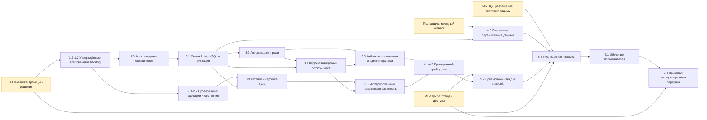

# Карта зависимостей SaparTravel

## Карта зависимостей работ

Стрелка означает, что результат слева нужен для начала или приёмки результата справа. Внешние узлы PO, поставщик, ИТ-служба и ИБ/ПДн имеют дату ответа и резервный путь в таблице ниже.

## Реестр внешних зависимостей

Даты рассчитаны от планового старта семестрового baseline 28.09.2026. Состав и внутренние координаторы сверены с карточкой проекта ЛАБ1. В ней нет ФИО внешнего представителя заказчика, владельца сервера ИТ-службы, ответственного поставщика или специалиста ИБ/ПДн; внешние контакты поэтому обозначены по организации/роли, а назван участник команды, который сопровождает зависимость.

| Что требуется | От кого / владелец | Контрольная дата подтверждения | Что блокирует | План при срыве | Контроль внутри команды |
|---|---|---|---|---|---|
| Подтверждение границ MVP, Must-историй и доступности для UAT | Внешний заказчик: руководитель регионального туристического инфоцентра / партнёрский туроператор (в ЛАБ1 ФИО не указано); внутренний PO — Абинсериков Нурасыл | 09.10.2026 | Фиксацию backlog, критерии приёмки и решение об UAT | Зафиксировать текущие Must-истории ЛЗ4 как временный baseline; открытые вопросы внести в журнал решений; не добавлять новые функции до ответа заказчика | Абинсериков Нурасыл (PO); Айдар Елнара (бизнес-/системный аналитик) |
| Тестовый сервер/стенд, доступы и параметры сети | ИТ-служба вуза / владелец сервиса (внешнее ФИО в ЛАБ1 не указано) | 16.10.2026 | Развёртывание приёмочной среды, восстановление backup на целевой инфраструктуре и финальную передачу | Продолжить на локальном Docker Compose; показать ограниченную демонстрацию без публичных данных; публичный пилот не объявлять до выдачи стенда | Бердебек Әмір (IT Project Manager / Delivery Manager) |
| Исходный каталог и правила актуальности туров/выездов | Пилотный поставщик / владелец каталога (название и внешнее ФИО в ЛАБ1 не указаны) | 30.10.2026 | Сверку и миграцию реальных данных, приёмку наполнения каталога | Использовать обезличенный seed-набор; оформить его как демонстрационный, не публиковать как коммерческое предложение; импорт реальных данных вынести в отдельное решение | Айдар Елнара (системный аналитик; владелец риска партнёрских данных в ЛАБ1); Баекеева Бібінұр (Database Developer) |
| Проверка обработки персональных данных, ролей и условий закрытого пилота | Служба ИБ и ответственный за ПДн / внешние ФИО в ЛАБ1 не указаны | 13.11.2026 | UAT с реальными персональными данными и запуск пилота | Использовать синтетические контакты и закрытый тестовый контур; заблокировать публичный пилот до письменного заключения | Бердебек Әмір (QA / Delivery Manager); Абинсериков Нурасыл (PO/backend) |

## Напоминания

К событиям подтверждения привязаны календарные напоминания за 3 дня: [dependency-reminders.ics](dependency-reminders.ics). После назначения конкретного владельца обновите контакт в этой таблице; даты в календаре являются плановыми и должны быть перенесены, если изменится академический календарь.