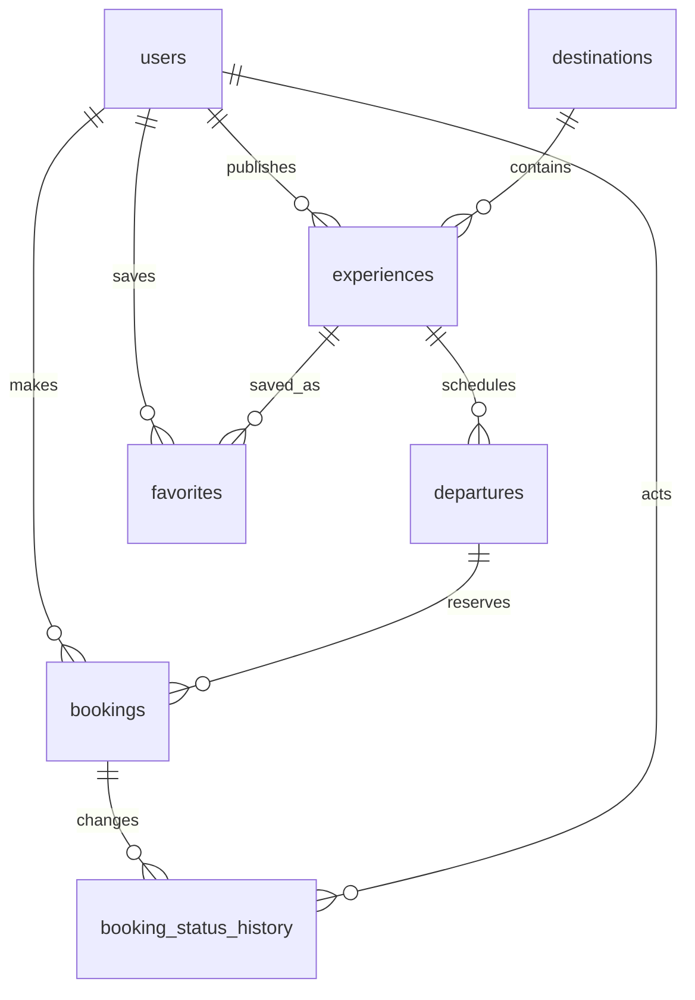

# PostgreSQL: схема и правила данных

Рабочее хранилище SaparTravel — PostgreSQL 17. Supabase Auth, `auth.users`, Supabase SDK и политики `auth.uid()` не используются. Авторизацию и разграничение доступа выполняет API. Источник истины о схеме — модели в `backend/app/domain/models.py` и миграции в `backend/migrations/`.

## Связи



| Таблица | Назначение и ограничения |
|---|---|
| `users` | Уникальный нормализованный email, хеш пароля, имя, активность и роль `traveler`, `vendor` или `admin`. |
| `destinations` | Направление, страна, континент, изображение и описания на RU/KK/EN; уникальный slug. |
| `experiences` | Тур, владелец, направление, категория, длительность, базовая цена USD, публикация и переводы контента. |
| `departures` | Даты конкретного выезда, вместимость и цена за человека; уникальная пара тур/дата. |
| `favorites` | Связь пользователь–тур; составной первичный ключ предотвращает повторы. |
| `bookings` | Пользователь, выезд, число путешественников, согласованная сумма, контакты, статус, номер и снимок условий. |
| `booking_status_history` | Запись каждой смены статуса с автором и временем. |

Связи защищены внешними ключами. Стоимость хранится в `NUMERIC`, расчёт выполняется через Decimal. Ограничения БД запрещают отрицательные суммы, недопустимые роли/статусы и некорректную вместимость. Часто используемые связи и фильтры индексированы.

## Локализация и снимки

Основные тексты имеют базовое русское поле и суффиксы `_en`/`_kk`. Программа по дням, теги и списки включённых/исключённых услуг хранятся как JSON-контент. Страна пока является атрибутом направления; отдельного международного справочника стран нет. Это прикладная схема, а не утверждение о строгой 3НФ всех контентных данных.

В бронировании фиксируются название и расположение тура, даты и итоговая сумма. Это намеренное дублирование условий сделки: редактирование карточки не изменяет уже созданную бронь.

## Бронирования и доступ

Все брони, кроме `cancelled`, учитываются в занятой вместимости выезда; для будущих дат это `pending` и `confirmed`. При создании заявки API блокирует строку выезда через `SELECT ... FOR UPDATE`, проверяет опубликованность тура, дату и доступность, затем записывает бронь и историю в одной транзакции. Отмена освобождает места. Статусы `cancelled` и `completed` конечные; завершение разрешается после окончания поездки.

Турист видит и отменяет только свои заявки. Поставщик управляет только своими предложениями и их бронированиями. Администратор управляет всем каталогом и назначает роли; последнего администратора нельзя понизить. Регистрация всегда создаёт туриста, даже если клиент пытается передать другую роль.

## Миграции и данные

```bash
cd backend
alembic upgrade head
python -m app.seed
```

Подключение берётся из `DATABASE_URL=postgresql+psycopg://...`; перед командами задайте переменные окружения, как описано в README. Повторный seed не должен создавать дубликаты или перезаписывать отредактированные туры. Даты исходных выездов считаются относительно первого наполнения; автоматического продления завершившихся выездов нет. Новые даты добавляются через кабинет.

SQLite разрешена только для изолированных быстрых тестов. Рабочая база и интеграционные проверки используют PostgreSQL. Старый SQL для Supabase применять не требуется.
